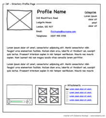

## Prerequisites
- None

## Objectives
- Draw simple wireframes to mock up a web page.

## Sketching and Wireframing
### What is a wireframe?
A **wireframe** is an image that sketches out the layout of major pieces of content within a page, without all of the fully-rendered detail that might be present in an illustration.

Although making detailed, feature-rich wireframes is typically the province of the UX/UI designer, even developers can produce basic layout sketches, and these sketches are extremely useful in the planning process as a tool to clarify and codify your vision. They also segue easily into the box model, which we explored earlier today.

Within the scope of this course, we will not be expecting you to produce designer-level wireframes; however, we _will_ be expecting you to produce low-fidelity sketches for your projects. A good sketch is simple, but just complex enough to convey the gist of the page. It may feature minimal text, or interactive features like drop-down menus and pop-ups/modals. Below are some examples of sketches that have been submitted by students in previous cohorts. Some are high fidelity and some are lower; some were drawn by hand and some were drawn using design tools like Balsamiq; however, all of the following would be considered acceptable as far as WDI projects are concerned.

[Compact](images/compact.png)

[MBTA](images/mbta.png)

[CrossHatch](images/crosshatch.jpg)

[Timeline](images/timeline.png)

[Art City](https://github.com/breduffy/ArtCity_app/blob/master/z_Mockups/Project%202_Art_City_Mockups.pdf)
(This last one is extremely far on the high-fidelity end of the spectrum.)

A low-fidelity wireframe or sketch should usually not overly concern itself with things like
* color scheme
* fonts
* specific content (images, written copy, etc)
* animations and timing

If you find yourself diving into those details, you may be going too deep. The purpose of a sketch is to be light, flexible, and even disposable if necessary.

#### Lab :: Sketching and Wireframing
Individually, pick one of the eight following sites and draw a basic sketch for the site on a patch of whiteboard. Focus on capturing the key elements of layout for the page, but **DO NOT INCLUDE ANY TEXT**. When you're finished, rotate within your squads, and see if you can identify your teammate's site by their sketch.

* [Wikipedia](https://en.wikipedia.org)
* [NYtimes.com](http://www.nytimes.com/)
* [Reddit](https://www.reddit.com/)
* [Google](https://www.google.com/)
* [ESPN.com](http://espn.go.com/)
* [TripAdvisor](http://www.tripadvisor.com/)
* [City of Boston](http://www.cityofboston.gov/)
* [JCrew](https://www.jcrew.com/index.jsp)

### Resources

* [Wirify](http://www.wirify.com/), a tool that draws up rudimentary wireframes for existing sites.
* [Balsamiq](https://balsamiq.com/), a sketching tool for making high-fidelity wireframes

[License](LICENSE)
------------------

Source code distributed under the MIT license. Text and other assets copyright
General Assembly, Inc., all rights reserved.
